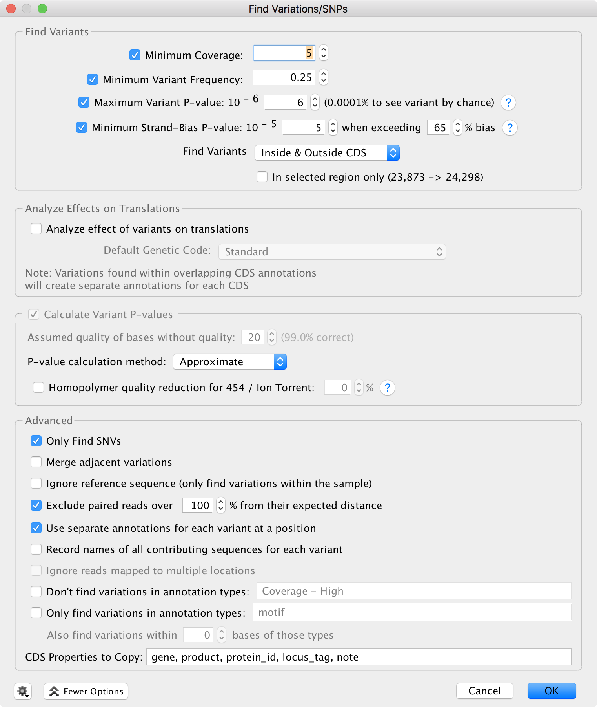

# Ebola strains

Samples from the 2014 West African outbreak collected U.S. Army Medical Research Institute of Infectious Diseases.

1. Files are located on Locus in the ebov directory.   

   ```bash
   cp -r /hpcdata/bcbb/poorani/NGSclass/ebov .
   cd ./ebov
   ```

2. Run FastQC and MultiQC and examine quality.

3. There are multiple samples in the folder.  Each will have a different SRA run number.  The samples with `_1.fastq` or `_2.fastq` are paired-end samples.  The ones without those suffixes are samples where the reads have been merged, and can be considered single-end data (you may need to look at the tool help to see how to analyze single end).  Choose a single sample to analyze.  

4. Trim the data using BBDuk.

5. Build a Bowtie2 index from the [NC_002549](https://www.ncbi.nlm.nih.gov/nuccore/NC_002549) reference genome and map the reads against the reference.

6. View the mapping in Geneious.

7. To find SNPs, look under Annotate and Predict for Find Variations/SNPs...




8. **Extra:** Run the trimming and mapping on the other samples (originally this exercise was to be in a group where everyone would run a different sample and then share).  Copy all the sam files to your computer.  You can do a comparative analysis of all the Ebola samples in Geneious. Tutorial [here](https://assets.geneious.com/documentation/geneious/App+Note+-+Creating+SNP+Trees+in+Geneious.pdf).  
