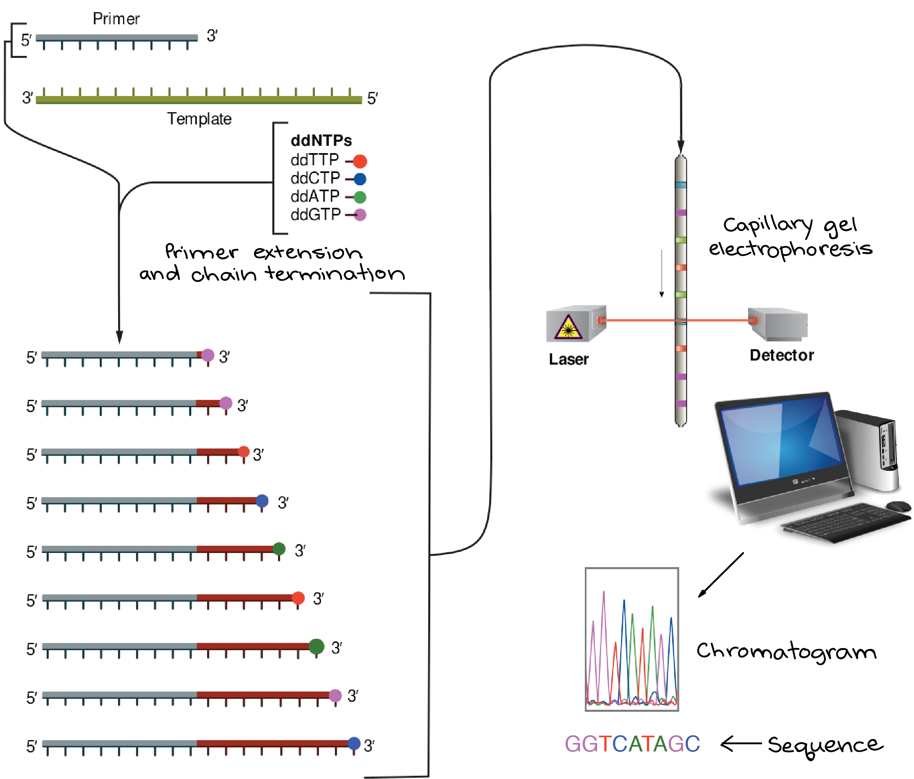
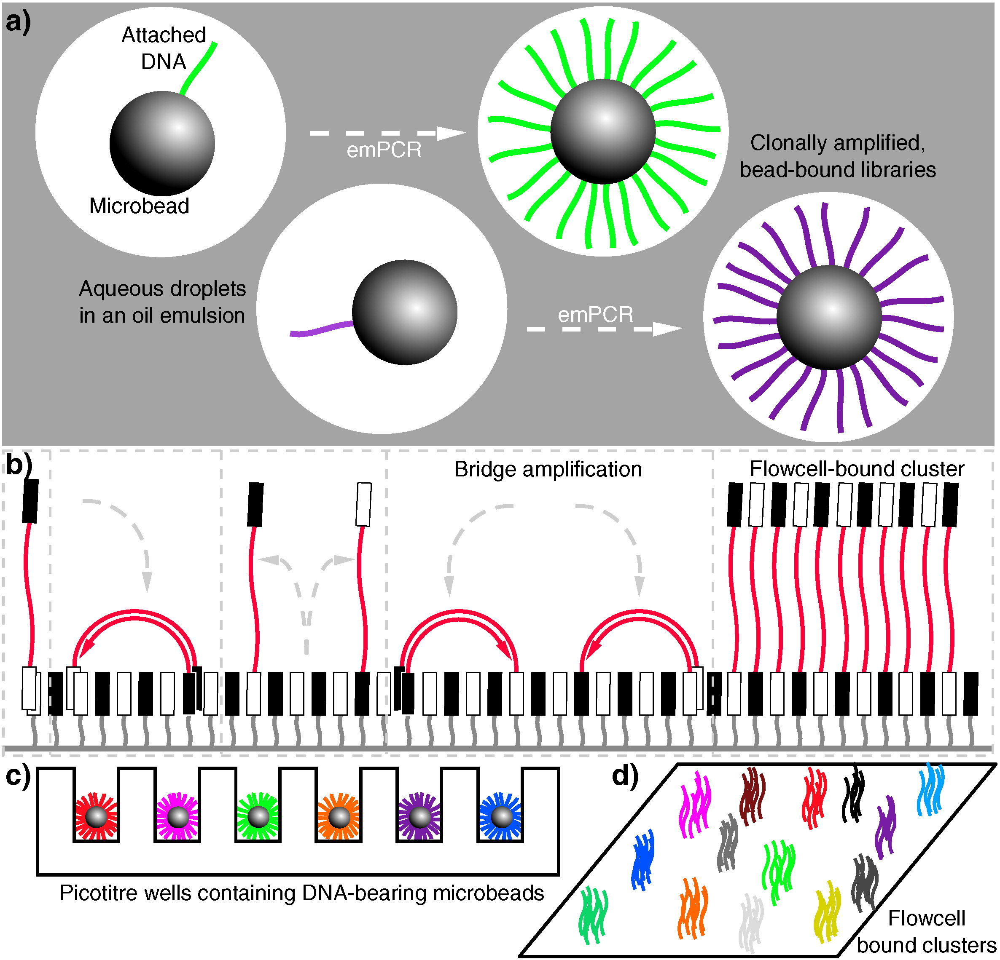
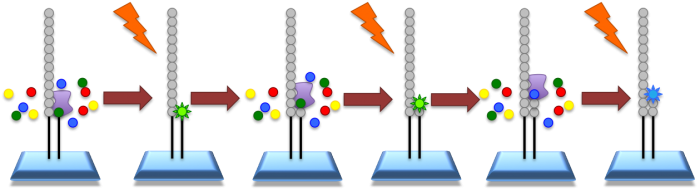

##  Short History of Sequencing 1 

+ First generation
+ Coulson & Sanger 'plus and minus' (1975) – first DNA genome sequenced *ϕ* X174 bacteriophage
+ Maxam and Gilbert chemical cleavage (1977)
+ Sanger sequencing – chain-termination (1977)



---

##  Short History of Sequencing 2 

**Next-generation (NGS) – short read**

+ 454 Life Sciences – pyrosequencing (now defunct)
	+ Parallelization of the sequencing reactions
	+ First high-throughput sequencing machine
+ **Solexa** **/Illumina** – SBS: sequencing by synthesis
	+ Fluorescent reversible-terminator
	+ Read length ~ 150-300bp
+ Other methods – ABI SOLiD (defunct) and Ion Torrent

```{r conditional_block2,  results='asis', eval=!fmt, echo=F}
cat(".pull-left[]

.pull-right[]")

```


```{r conditional_block3,  results='asis', eval=fmt, echo=F}
cat(" ")

```

???

Pyrosequencing - infer the nucleotides from light production of enzyme luciferase.

First HTS machine was the GS 20

Technically, Sanger and pyrosequencing are also methods of sequencing by synthesis (using dna polymer
ase to add nucleotides to the complementary strand of the template, but that's what solexa called the
ir method

Amplification methods differ

454

DNA molecules being clonally amplified in an emulsion PCR (emPCR). Adapter ligation and PCR produces
DNA libraries with appropriate 5′ and 3′ ends, which can then be made single stranded and immobilized
 onto individual suitably oligonucleotide-tagged microbeads. Bead-DNA conjugates can then be emulsifi
ed using aqueous amplification reagents in oil, ideally producing emulsion droplets containing only o
ne bead (illustrated in the two leftmost droplets, with different molecules indicated in different co
lours). Clonal amplification then occurs during the emPCR as each template DNA is physically separate
 from all others, with daughter molecules remaining bound to the microbeads. This is the conceptual b
asis underlying sequencing in 454, Ion Torrent and polony sequencing protocols.

Illumina – bridge amplification


---

##  Short History of Sequencing 3 

+ Third generation - long read
+ Sometimes characterized by not needing amplification – potentially sequencing entire single molecules (SMS)
+ PacBio – SMRT
	+ Fast
	+ ~10kb
	+ Error rate only a little higher than short read
+ Oxford Nanopore – ION
	+ Faster and cheaper
	+ Error rates are higher than for short reads
	+ 5-10kb
+ 10X Genomics
	+ New methods of barcodes/indexing

