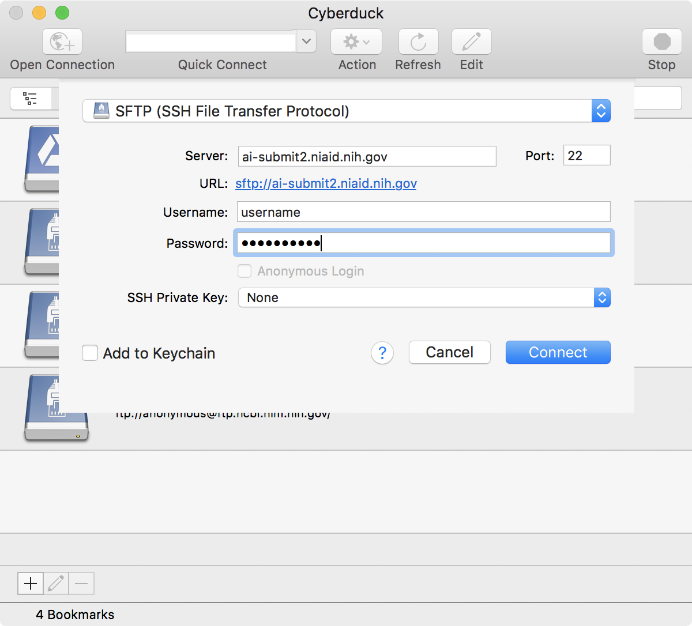

# Locus

- [Login via ssh](#login-via-ssh)
- [Interactive session](#interactive-session)
- [Access folders via sftp](#access-folders-via-sftp)
- [Basic unix commands](#basic-unix-commands)
- [More information for the curious - get an account!](#more-information-for-the-curious)

## Login via ssh

```bash
ssh -X username@ai-submit2.niaid.nih.gov
## enter password
```

## Interactive session

```bash
qrsh -l h_vmem=32G
```

- `h_vmem` is the maximum amount of memory you will be allowed to use.  You should set this parameter based on how big the files are that you will be working with.  32 gigabytes is (way?) more than enough for the datasets in this seminar.


## Access folders via sftp

- [Cyberduck](https://cyberduck.io/) -> Open Connection (icon top left of the window)



## Basic unix commands

```bash
## list files in directory
ls

## get the path to your current directory
pwd

## change to another directory (replace directoryname with name of directory)
cd directoryname

## change to the directory above
cd ..

## change to your home directory
cd

## look at a file (replace filename)
less filename
## to quit less - type `q`

## unload all modules (in case you get an error when you load one)
module purge

## list all loaded modules
module list

## close your interactive session or log out of locus
exit
```

## More information for the curious

[Locus website](https://locus.niaid.nih.gov) - if you don't have a Locus server account, the first time you log into the website (using your regular NIH creds), you will get an email telling you how to request an account.

[Request an account](https://locus.niaid.nih.gov/userportal/documentation.php#Getting-Started/Request-an-Account) - in case you lose the email

[BCBB unix class materials](https://github.com/niaid/ACE/tree/master/unix) - look at pptx slides for info about the commands in the scripts

### Copy folders from Locus to Laptop via command line

```bash
## example command: replace username with your username!
scp -r username@ai-submit2.niaid.nih.gov:/classhome/username ~/Desktop

 ## basic command structure
 ## `-r` means "recursive" so we copy the folder and everything in it.
 scp -r fromfoldername tofoldername

 ## general command
 scp -r username@servername:serverfolderpath laptopfolderpath
```

