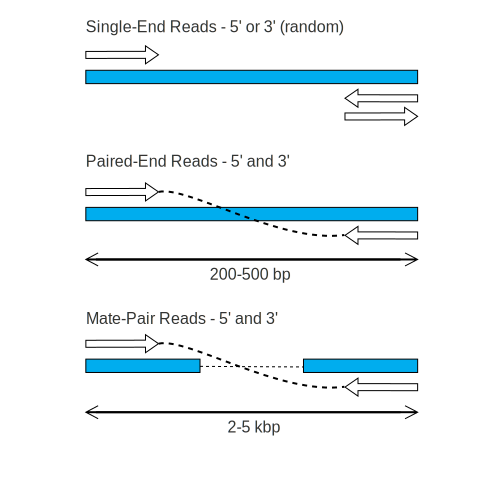
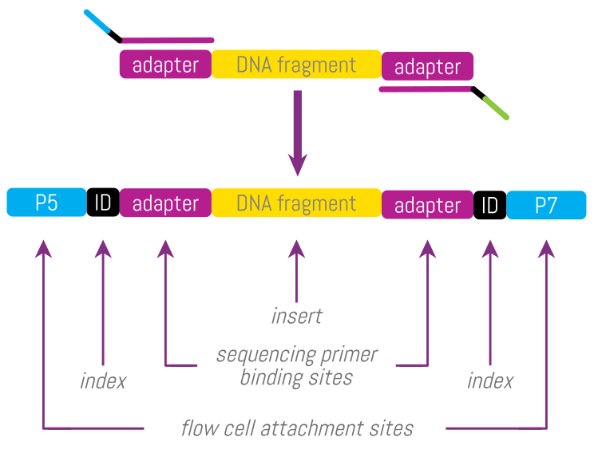

```{r setup, include=F}
fmt <- rmarkdown::default_output_format(knitr::current_input())$name == "md_document"
outh <- function(moonh) { if (fmt) return(NULL) else return(moonh) }
```

```{r layout, results='asis', include=!fmt, echo=F}
writeLines(c("", "layout: true", "class: titleandcontent", "", "---"))
```

##  BCBB Science Support

+ [bioinformatics.niaid.nih.gov](https://bioinformatics.niaid.nih.gov)
+ More help email: bioinformatics@niaid.nih.gov


---
```{r layout1, results='asis', include=!fmt, echo=F}
writeLines(c("class: title-slide center middle section-header"))
```

# Sequencing intro

---

##  DNA polymerisation


+ In nature, during DNA replication, the purpose of DNA polymerisation is to the next complementary base to the new strand.
+ The purpose of sequencing is to **figuring out what that next base added is**
+ **This is where the various sequencing technologies differ**

---

## Basic steps: Sample to data
+ Protocol depends on sample type and sequencing type.

1. Extract the DNA.  
2. Library preparation.
    + Fragmenting the DNA.
    + Adding *adapter* sequences to the ends.
3. Template amplication*
    + Clonal amplification of the fragments to ensure a clear signal.
4. Sequencing*

\*3 & 4 take place in the sequencing machine.


---

```{r layout2, results='asis', include=!fmt, echo=F}
writeLines(c("class: title-slide center middle section-header"))
```


#  Files

---

## File Formats

+ Sequence Data
	+ FASTA/QUAL
	+ FASTQ
	+ FAST5 - nanopore
	+ Older formats – sff
+ Alignment Data
	+ SAM
	+ BAM
	+ BED


---

##  FASTA and/or QUAL 

+ Sequence and quality scores are separate files – old data
+ Or FASTA only with no quality data available
	+ Pre-processed in some way
+ Header
+ Sequence
	+ All on one line
	+ Or it will be truncated – 80-120 characters


---

## FASTQ

- Sequence and quality in single file


`@M03213:59:000000000-AWR6D:1:1101:12406:1145 1:N:0:NCCTGAGC+NTATTAAG`
`GTGCCAGCAGCCGCGGTAATACGGAGGGTGCGAGCGTTAATCGGAATAACTGGGCGTAAAGGGCACGCAGGCGGATTTTTAAGTGAGGTNTGAAAGCCCCGGGCTTAACCTGGGAATTGCATTTCAGACTGGGAATCTAGAGTACTTTAGGGAGGGGTAGAATTCCACGTGTAGCGGTGAAATGCGTAGAGATGTGGAGGAATACCGAAGGCGAAGGCAGCCCCTTGGGAATGTACTGNCGCTCATGGTCGAACGCGTGGG`

### Header

`@<instrument>:<run number>:<flowcell>:<lane>:<tile>:<x-pos>:<y-pos>  <read>:<is filtered>:<control number>:<sample number>`

- Read identifier is the beginning part (before the space)
- The end part (after the space) is used for demuxing or PE information

### Raw sequence
- All on one line - no spaces - DNA or RNA, should be one of the IUPAC characters.


---

##  FASTQ Quality Scores
+ called **Phred** scores after the inventor **Ph**il Green.


### How are they calculated?
1. Phred score Q:  Given *p*, the probability that the corresponding base call is incorrect,  
*Q = -log<sub>10</sub>p*. 
    + 40 is usually highest score – very, very rarely up to 60
2. Add constant: Q+C
    + usually, *C = 33* &rarr; Phred+33 format is most common (Illumina > 1.8 ~2011)
3. This value, Q+C, is encoded as an [ASCII](https://www.cs.cmu.edu/~pattis/15-1XX/common/handouts/ascii.html) character in the FASTQ file.

```{r fastqbreak, results='asis', include=!fmt, echo=F}
cat(".pull-left[]

.pull-right[]

---
    
## Example    ")
```

```
@M03213:59:000000000-AWR6D:1:1101:12406:1145 1:N:0:NCCTGAGC+NTATTAAG
GTGCCAGCAGCCGCGGTAATACGGAGGGTGCGAGCGTTAATCGGAATAACTGGGCGTAAAGGGCACGCAGGCGG
+
-6,ACGGAEFGGG<<FFG?FC@EF8AFCFGEGGCCCBGGGGGGDGGGGGEEFA<FGCE,EFDCFFFGGGGCCDG
```

*Example*  
First quality character is `-` which is *45* in the ASCII table.  
*Q = 45-33 = 12*
```{r conditional_block4,  results='asis', eval=!fmt, echo=F}
cat(".pull-left[]

.pull-right[]
")
```

```{r conditional_block5,  results='asis', eval=fmt, echo=F}
writeLines("<p float='center'></p>")
```

???

Line 3 is single '+' https:// www.cs.cmu.edu /~ pattis /15-1XX/common/handouts/ ascii.html 

Phred+33 is Sanger standard. Illumina switched around different standards for a while and settled back to Phred+33.
Starting with Illumina 1.3-1.7 used Phred+64.
Illumina 1.5-1.7 if quality scores were below Q15 at end of read, were arbitrarily assigned score 2 which is B.

---

##  Convert from FASTQ to FASTA 

+ FASTX-Toolkit
+ SRA-toolkit – download data and automatically convert


---
```{r layout3, results='asis', include=!fmt, echo=F}
writeLines(c("class: title-slide center middle section-header"))
```


#  Sequence data 

+ What it looks like, types, quality

---

##  Single End vs Paired End vs Mate-Pair

```{r, out.height = outh("600px"), echo=F}

```


---

##  Adapters, Primers, Indexes 

+ Reads from a sequencer may have extra sequences on either end that we should remember are there
+ Indexes are used by the sequencer to separate data into separate sample files – **demultiplex**

```{r, out.height = outh("500px"), echo=F}

```

---

##  Anatomy of an Illumina Run 

+ What comes out of the sequencer?


---

##  Converting and Demultiplexing 

+ Illumina sequencer can convert & demux itself
+ [bcl2fastq](https://support.illumina.com/sequencing/sequencing_software/bcl2fastq-conversion-software.html)
	+ Converts BaseCalls to FASTQ
	+ Demultiplexes the data
		+ Reads that it can't figure out goes into files called "Undetermined"
		+ Should check if the Undetermined files are unreasonably Large
		+ Uses SampleSheet.csv to map barcodes to samples
+ Other tools
	+ Idemp - https://github.com/yhwu/idemp, fastq-pair https://github.com/linsalrob/fastq-pair


---

##  How to assess data quality? 

+ The sequencing lab runs quality-control tests to ensure that the actual run was successful.
+ We should run our own QC prior to analysis
	+ We should all be skeptics! To avoid misinterpretation of the data due to unexpected bias
+ QC measurements can report the following:
	+ Percent GC in sample reads
	+ Presence of overrepresented kmers and sequences such as adapters
	+ Per base quality score
	+ Distribution of nucleotide bases
+ After mapping reads to a genome, additional test could be run to determine:
	+ Mapping error rate
	+ Percent of possible PCR duplicates (reads with same start and end position in reference genome)
	+ Distribution of insert size (pair ends)


---

## Sequencing QC 

+ **FASTQC:** https://www.bioinformatics.babraham.ac.uk/projects/fastqc/
+ http://multiqc.info/
+ BaseSpace Tips: https://blog.horizondiscovery.com/diagnostics/the-5-ngs-qc-metrics-you-should-know
+ Different types of data require different QC metrics
	+ Example: whole genome shotgun vs amplicon
[https://www.bioinformatics.babraham.ac.uk/projects/fastqc/](https://www.bioinformatics.babraham.ac.uk/projects/fastqc/)
[http://multiqc.info/](https://blog.horizondiscovery.com/diagnostics/the-5-ngs-qc-metrics-you-should-know)
[ https://blog.horizondiscovery.com/diagnostics/the-5-ngs-qc-metrics-you-should-know](http://multiqc.info/)


---

```{r layout4, results='asis', include=!fmt, echo=F}
writeLines(c("class: title-slide center middle section-header"))
```


#  Improving Data Quality 

Trimming and Filtering


---

```{r appendix, results='asis', include=!fmt, echo=F}
writeLines(c("class: title-slide middle section-header"))
```


# Appendix 1: Short history of sequencing

+ Heather, J. M., & Chain, B. (2016). The sequence of sequencers: The history of sequencing DNA. *Genomics*, *107*(1), 1–8. doi: [10.1016/j.ygeno.2015.11.003](https://dx.doi.org/10.1016/j.ygeno.2015.11.003)

+ Ambardar, S., Gupta, R., Trakroo, D., Lal, R., & Vakhlu, J. (2016). High Throughput Sequencing: An Overview of Sequencing Chemistry. *Indian Journal of Microbiology*, 56(4), 394–404. doi: [10.1007/s12088-016-0606-4](https://doi.org/10.1007/s12088-016-0606-4)


---

```{r child = "history.Rmd"}
```
