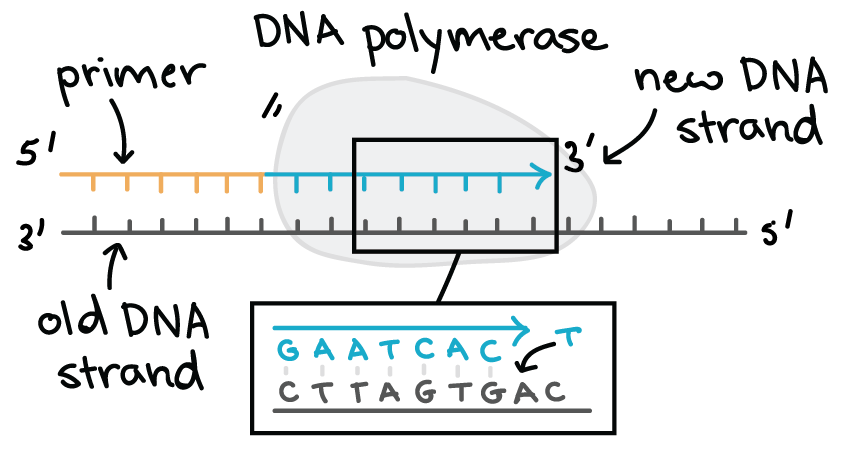
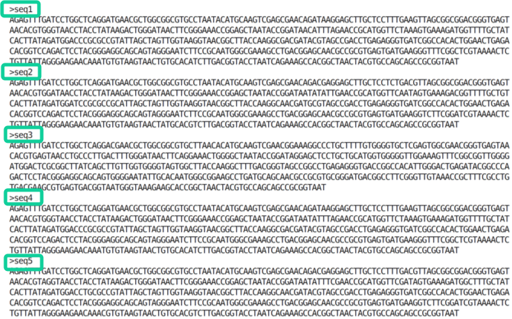
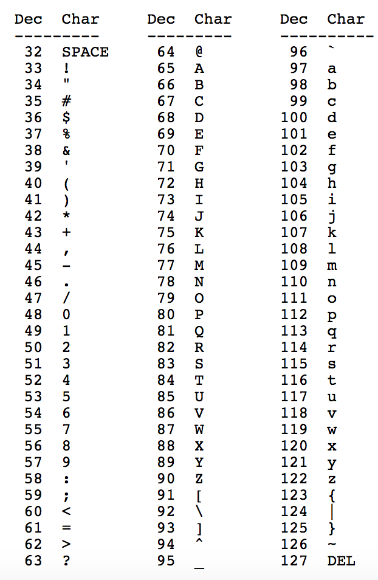
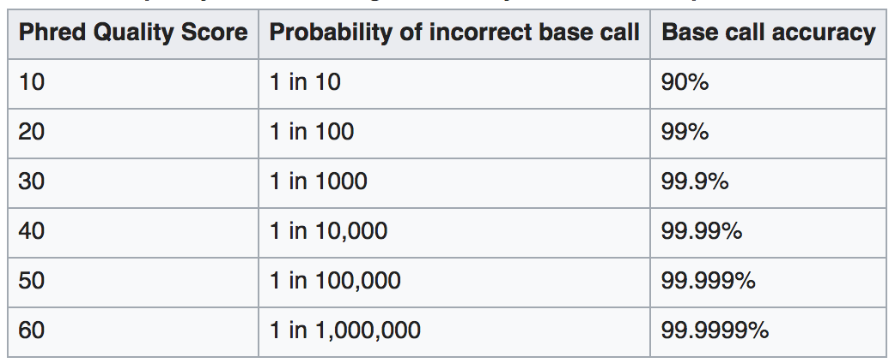
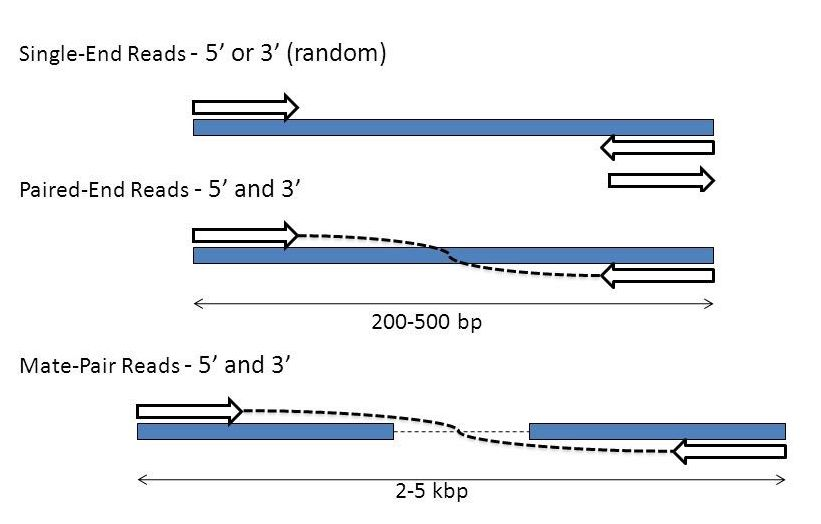
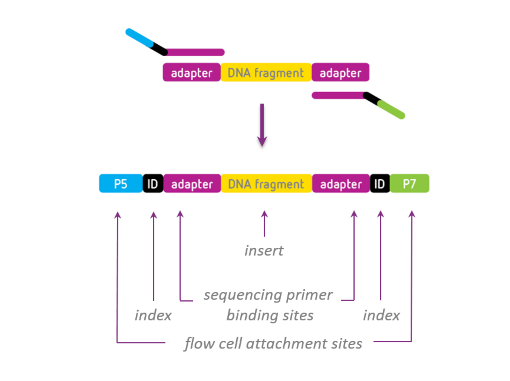
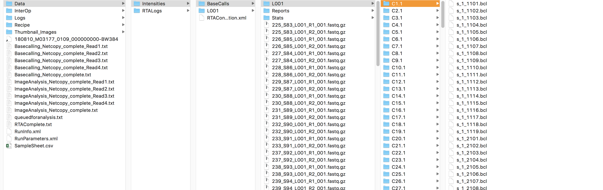

```{r setup, include=F}
fmt <- rmarkdown::default_output_format(knitr::current_input())$name == "md_document"
```

```{r conditional_block1,  results='asis', eval=fmt, echo=F}
cat("# Introduction to Sequence QC
Bioinformatics and Computational Biosciences Branch Seminar

4 March 2019

Poorani Subramanian, Computational Biology Specialist
    ")
```


##  BCBB Science Support

+ [bioinformatics.niaid.nih.gov](https://bioinformatics.niaid.nih.gov)
+ More help email: bioinformatics@niaid.nih.gov


---

##  Why is sequencing challenging? 

+ The point of sequencing is not adding the next base
+ The point of sequencing is to **figuring out what that next base added is**
+ **This is where the various sequencing technologies differ**



---

##  Short History of Sequencing 1 

+ First generation
+ Coulson & Sanger 'plus and minus' (1975) – first DNA genome sequenced *ϕ* X174 bacteriophage
+ Maxam and Gilbert chemical cleavage (1977)
+ Sanger sequencing – chain-termination (1977)


---

##  Short History of Sequencing 2 

**Next-generation (NGS) – short read**

+ 454 Life Sciences – pyrosequencing (now defunct)
	+ Parallelization of the sequencing reactions
	+ First high-throughput sequencing machine
+ **Solexa** **/Illumina** – SBS: sequencing by synthesis
	+ Fluorescent reversible-terminator
	+ Read length ~ 150-300bp
+ Other methods – ABI SOLiD (defunct) and Ion Torrent

```{r conditional_block2,  results='asis', eval=!fmt, echo=F}
cat(".pull-left[]

.pull-right[]")

```


```{r conditional_block3,  results='asis', eval=fmt, echo=F}
cat("

")

```

---

##  Short History of Sequencing 3 

+ Third generation - long read
+ Sometimes characterized by not needing amplification – potentially sequencing entire single molecules (SMS)
+ PacBio – SMRT
	+ Fast
	+ ~10kb
	+ Error rate only a little higher than short read
+ Oxford Nanopore – ION
	+ Faster and cheaper
	+ Error rates are higher than for short reads
	+ 5-10kb
+ 10X Genomics
	+ New methods of barcodes/indexing


---

#  File Formats 


---

##  File Formats 

+ Sequence Data
	+ FASTA/QUAL
	+ FASTQ
	+ FAST5 - nanopore
	+ Older formats – sff
+ Alignment Data
	+ SAM
	+ BAM
	+ BED


---

##  FASTA and/or QUAL 

+ Sequence and quality scores are separate files – old data
+ Or FASTA only with no quality data available
	+ Pre-processed in some way
+ Header
+ Sequence
	+ All on one line
	+ Or it will be truncated – 80-120 characters


---

## FASTQ

- Sequence and quality in single file

```
@M03213:59:000000000-AWR6D:1:1101:12406:1145 1:N:0:NCCTGAGC+NTATTAAG
GTGCCAGCAGCCGCGGTAATACGGAGGGTGCGAGCGTTAATCGGAATAACTGGGCGTAAAGGGCACGCAGGCGGATTTTTAAGTGAGGTNTGAAAGCCCCGGGCTTAACCTGGGAATTGCATTTCAGACTGGGAATCTAGAGTACTTTAGGGAGGGGTAGAATTCCACGTGTAGCGGTGAAATGCGTAGAGATGTGGAGGAATACCGAAGGCGAAGGCAGCCCCTTGGGAATGTACTGNCGCTCATGGTCGAACGCGTGGG
```

```
@<instrument>:<run number>:<flowcell>:<lane>:<tile>:<x-pos>:<y-pos>  <read>:<is filtered>:<control number>:<sample number>
```

### Header
- Read identifier is the beginning part (before the space)
- The end part (after the space) is used for demuxing or PE information

### Raw sequence
- All on one line - no spaces - DNA or RNA, should be one of the IUPAC characters.


---

##  FASTQ Quality Scores

+ Sequence and quality in single file

```
@M03213:59:000000000-AWR6D:1:1101:12406:1145 1:N:0:NCCTGAGC+NTATTAAG
GTGCCAGCAGCCGCGGTAATACGGAGGGTGCGAGCGTTAATCGGAATAACTGGGCGTAAAGGGCACGCAGGCGG
+
-6,ACGGAEFGGG<<FFG?FC@EF8AFCFGEGGCCCBGGGGGGDGGGGGEEFA<FGCE,EFDCFFFGGGGCCDG
```
+ Quality Scores
+ Phred quality scores:  Let *p* be the the probability that the corresponding base call is incorrect, then
+ Additive constant - Q+C – encoded in ASCII
+ Usually, constant is 33 – Phred+33
+ 40 is usually highest score – very, very rarely up to 60
+ Illumina > 1.8 ~2011

```{r conditional_block4,  results='asis', eval=!fmt, echo=F}
cat(".pull-left[]

.pull-right[]
")
```

```{r conditional_block5,  results='asis', eval=fmt, echo=F}
cat("

")
```

- [ASCII table reference](https://www.cs.cmu.edu/~pattis/15-1XX/common/handouts/ascii.html)

---

##  Convert from FASTQ to FASTA 

+ FASTX-Toolkit
+ SRA-toolkit – download data and automatically convert


---

##  Sequence data 

+ What it looks like, types, quality

---

##  Single End vs Paired End 




---

##  Adapters, Primers, Indexes 

+ Reads from a sequencer may have extra sequences on either end that we should remember are there
+ Indexes are used by the sequencer to separate data into separate sample files – **demultiplex**


---

##  Anatomy of an Illumina Run 

+ What comes out of the sequencer?


---

##  Converting and Demultiplexing 

+ Illumina sequencer can convert & demux itself
+ [bcl2fastq](https://support.illumina.com/sequencing/sequencing_software/bcl2fastq-conversion-software.html)
	+ Converts BaseCalls to FASTQ
	+ Demultiplexes the data
		+ Reads that it can't figure out goes into files called "Undetermined"
		+ Should check if the Undetermined files are unreasonably Large
		+ Uses SampleSheet.csv to map barcodes to samples
+ Other tools
	+ Idemp - https://github.com/yhwu/idemp, fastq-pair https://github.com/linsalrob/fastq-pair


---

##  How to assess data quality? 

+ The sequencing lab runs quality-control tests to ensure that the actual run was successful.
+ We should run our own QC prior to analysis
	+ We should all be skeptics! To avoid misinterpretation of the data due to unexpected bias
+ QC measurements can report the following:
	+ Percent GC in sample reads
	+ Presence of overrepresented kmers and sequences such as adapters
	+ Per base quality score
	+ Distribution of nucleotide bases
+ After mapping reads to a genome, additional test could be run to determine:
	+ Mapping error rate
	+ Percent of possible PCR duplicates (reads with same start and end position in reference genome)
	+ Distribution of insert size (pair ends)


---

## Sequencing QC 

+ **FASTQC:** https://www.bioinformatics.babraham.ac.uk/projects/fastqc/
+ http://multiqc.info/
+ BaseSpace Tips: https://blog.horizondiscovery.com/diagnostics/the-5-ngs-qc-metrics-you-should-know
+ Different types of data require different QC metrics
	+ Example: whole genome shotgun vs amplicon
[https://www.bioinformatics.babraham.ac.uk/projects/fastqc/](https://www.bioinformatics.babraham.ac.uk/projects/fastqc/)
[http://multiqc.info/](https://blog.horizondiscovery.com/diagnostics/the-5-ngs-qc-metrics-you-should-know)
[ https://blog.horizondiscovery.com/diagnostics/the-5-ngs-qc-metrics-you-should-know](http://multiqc.info/)


---

#  Improving Data Quality 

+ Trimming and Filtering
