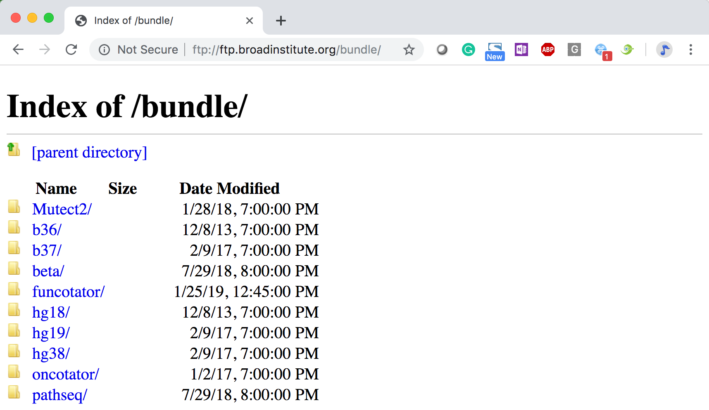
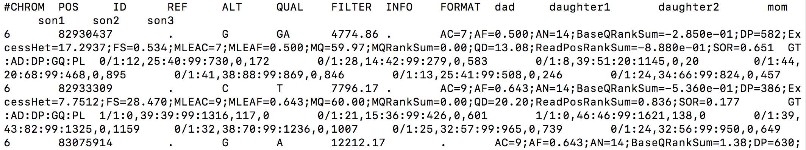
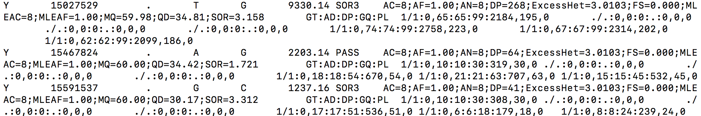
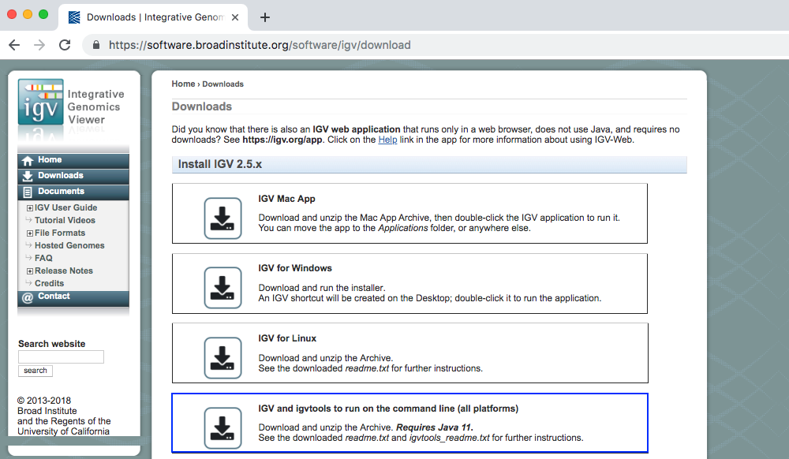
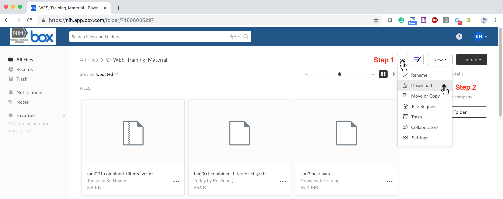
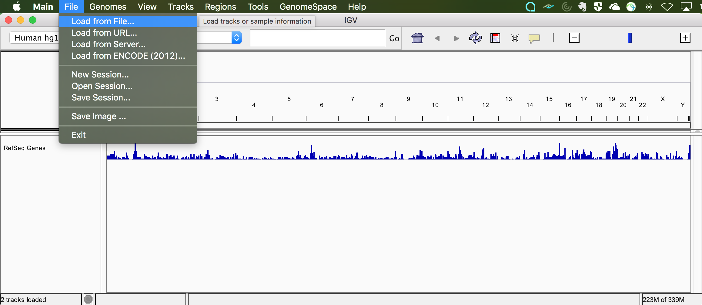
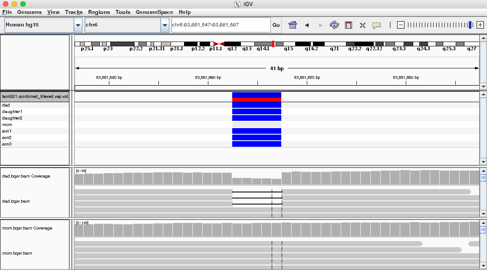
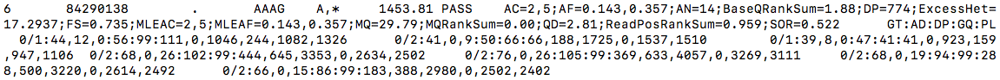
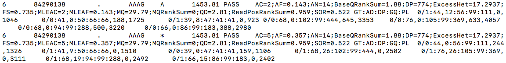
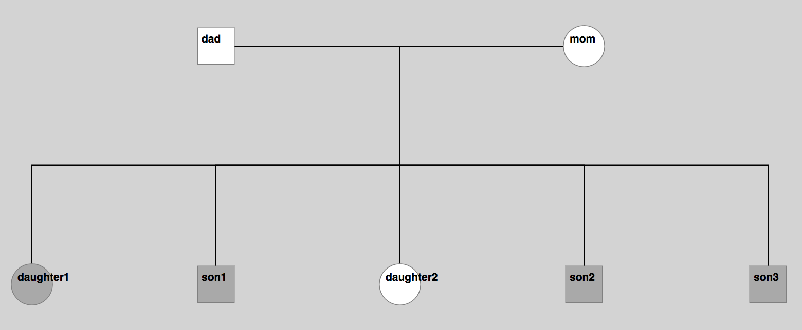

### Exercise for Exome Sequencing Data Analysis training class - June 13<sup>rd</sup>, 2019


##### FAQs
1. Why does the below error pop up when I load a module?
```sh
module load FastQC
Java/1.8.0_45(13):ERROR:150: Module 'Java/1.8.0_45' conflicts with the currently loaded module(s) 'Java/1.8.0_92'
Java/1.8.0_45(13):ERROR:102: Tcl command execution failed: conflict Java  
```
**A:** This is a frequently observed issue when multiple modules are loaded successively. On LOCUS, whenever a module is loaded, it's dependencies will be automatically loaded as well. The error message above indicates that there is another module that depends on 'Java/1.8.0_92' was loaded before FastQC which depends on a different version of Java. Usually, this kind of error can be safely ignored as long as it doesn't hamper your modules' functinality. Otherwise, you can fix it by loading you module after the unwanted version of dependencies is removed manually:
```sh
module unload Java/1.8.0_92
module load FastQC
```


**Instructions:** Copy the text from the gray boxes into the terminal when indicated.

#### **Part 1: Log into the Locus cluster**
```sh
ssh username@ai-submit1.niaid.nih.gov
```

If planning to run _X-Windows_ applications, use `ssh -X username@ai-submit1.niaid.nih.gov`

:notebook:NOTE:
  1. If you're running OS X 10.6 or 10.7 (Snow Leopard/Lion), you have the requisite software installed under /Applications/Utilities/X11, you just need to launch it. For 10.8 and newer, you need to install a free third party utility called **XQuartz**.

  2. For Windows, you will need to install a client like **Xwin32** or **Xceed**.

:rocket: Start an interactive session. When asked for password, input the same password you just used to log into LOCUS.
```  
  qrsh -pe threaded 8
```

*Please refer to [LOCUS Userportal](https://locus.niaid.nih.gov/userportal/documentation.php#Getting-Started/HPC-Basics) on how to customize computing resources such as threads and memory.*

:file_folder: copy the practice data to your home folder

```sh
cd #switch to home folder

mkdir WES_Tutorial

cd WES_Tutorial

cp -r /hpcdata/bcbb/wes_training/data/* .

ls
#dad  daughter1  daughter2  fam001.ped  mom  refSeq.sorted.txt  son1  son2  son3

ls son1
#son1.R1.fq  son1.R2.fq

```
If you need to deal with ILLUMINA BCL files, [bcl2fastq2](http://emea.support.illumina.com/sequencing/sequencing_software/bcl2fastq-conversion-software.html?langsel=/ch/) can be used for demultiplexing which convert the BCL files to fastq files.

:information_source: As we work, we will load modules, programs that we will use

_DO NOT COPY THE TEXT BELOW TO THE TERMINAL YET_
```sh
module load bwa
module load samtools
module load picard
module load gatk/4.0-8-Java-1.8.0_92
module load FastQC
module load IGV
module load verifyBamID
module load peddy
module load VEP/89-goolf-1.7.20
module load GEMINI
```

`module list
`
 : this will display modules that are currently loaded

:loudspeaker: Copy the code below into the terminal one step at a time

**_[GATK resource  bundles](https://software.broadinstitute.org/gatk/download/bundle):_**

**location:** ftp.broadinstitute.org/bundle

**username:** gsapubftp-anonymous

**password:**


#### **Part 2: Preprocessing (alignment and BQSR) & QC**

**1) Align the short reads in fastq files using BWA**

For bwa-mem -R parameter: RG=read group, ID=id, LB=library, SM=Sample, PL=platform (sequencer)
```sh
pwd
#/nethome/username/data

module load bwa

bwa mem  ##shows options
sample='son1' ##assign value for the sample variable

bwa mem -t 4 -M -R "@RG\tID:${sample}\tLB:${sample}\tSM:${sample}\tPL:ILLUMINA" \
 /hpcdata/bcbb/wes_training/reference/human_g1k_v37_decoy.fasta \
 ./${sample}/${sample}.R1.fq ./${sample}/${sample}.R2.fq \
 -o ./${sample}/${sample}.sam

ls son1
#son1.R1.fq  son1.R2.fq  son1.sam

```
:bulb:**Already done due to time limit** -- If reference index file not available, you will see the below error message when you run the above `bwa mem` command.
```
[E::bwa_idx_load_from_disk] fail to locate the index files
```
Create index for reference (*The following commands are for practice only.*)
```sh
cp /hpcdata/bcbb/wes_training/reference/ref_bk/human_1kg_decoy.fa .

bwa index human_1kg_decoy.fa
```

**2) Sort the sam file and convert it to bam file using samtools**
```sh
module load picard
java -jar ${EBROOTPICARD}/picard.jar SortSam I=./${sample}/${sample}.sam \
 O=./${sample}/${sample}.sorted.bam MAX_RECORDS_IN_RAM=1000000 CREATE_INDEX=true \
 VALIDATION_STRINGENCY=LENIENT SORT_ORDER=coordinate

ls son1
#son1.R1.fq  son1.R2.fq  son1.sam  son1.sorted.bai  son1.sorted.bam
```
Or combine the above 2 step together using the following command
```sh
module load bwa
module load picard
bwa mem -t 4 -M -R "@RG\tID:${sample}\tLB:${sample}\tSM:${sample}\tPL:ILLUMINA" \
 /hpcdata/bcbb/wes_training/reference/human_g1k_v37_decoy.fasta \
 ./${sample}/${sample}.R1.fq ./${sample}/${sample}.R2.fq | \
 java -Xmx30g -jar ${EBROOTPICARD}/picard.jar SortSam I=/dev/stdin \
 O=./${sample}/${sample}.sorted.bam MAX_RECORDS_IN_RAM=1000000 \
 CREATE_INDEX=true VALIDATION_STRINGENCY=LENIENT SORT_ORDER=coordinate
```
**3) Mark duplicates**
```sh
java -jar ${EBROOTPICARD}/picard.jar MarkDuplicates \
 I=./${sample}/${sample}.sorted.bam O=./${sample}/${sample}.markdup.bam \
 VALIDATION_STRINGENCY=LENIENT AS=true CREATE_INDEX=true \
 M=./${sample}/${sample}.bwa.markdup.log
```
**4) QC on the aligned BAM**

**i)Basic quality control metrics for raw next generation sequencing data -- [FataQC](https://www.bioinformatics.babraham.ac.uk/projects/fastqc/)**
```sh
module load FastQC

fastqc -f bam -o ./${sample} ./${sample}/${sample}.markdup.bam

ls son1
#son1.bwa.markdup.log  son1.markdup.bam          son1.markdup_fastqc.zip  son1.R2.fq  son1.sorted.bai
#son1.markdup.bai      son1.markdup_fastqc.html  son1.R1.fq               son1.sam    son1.sorted.bam
```
Press 'cmd + t' to open a new command line terminal and copy the fastQC output to local.
```sh
scp usrname@ai-submit1.niaid.nih.gov:~/data/son1/son1.markdup_fastqc.html .
```


```sh
module unload FastQC    #unload the module to avoid package conflict in the next steps  
```

**ii) Sample Coverage**

*As the DepthOfCoverage module is not ported in GATK4 yet, we'll use GATK3 for this step.*
```sh
module load gatk/3.8.1-Java-1.8.0_92

find . -name "*markdup.bam" > fam001_bams.list   #generate the input bam list

cat fam001_bams.list
#/nethome/username/data/son1/son1.markdup.bam
#/nethome/username/data/son2/son2.markdup.bam
#/nethome/username/data/son3/son3.markdup.bam
#/nethome/username/data/daughter1/daughter1.markdup.bam
#/nethome/username/data/daughter2/daughter2.markdup.bam
#/nethome/username/data/dad/dad.markdup.bam
#/nethome/username/data/mom/mom.markdup.bam

java -jar $EBROOTGATK/GenomeAnalysisTK.jar -T DepthOfCoverage \
  -R  /hpcdata/bcbb/wes_training/reference/human_g1k_v37_decoy.fasta \
  -o ./fam001_dov \
  -I fam001_bams.list \
  -geneList:REFSEQ /hpcdata/bcbb/wes_training/reference/refSeq.sorted.txt \
  -ct 4 -ct 10 -ct 15 -ct 20 \
  -L /hpcdata/bcbb/wes_training/reference/exome.interval_list

ls |grep "fam001_dov.sample_*"
#fam001_dov.sample_cumulative_coverage_counts
#fam001_dov.sample_cumulative_coverage_proportions
#fam001_dov.sample_gene_summary
#fam001_dov.sample_interval_statistics
#fam001_dov.sample_interval_summary
#fam001_dov.sample_statistics
#fam001_dov.sample_summary

module unload gatk/3.8.1-Java-1.8.0_92
```
Instructions on [how](https://software.broadinstitute.org/gatk/documentation/article.php?id=1329) to prep the RefSeq gene list.


**5) Base Quality Score Recalibration**
```sh
module load gatk/4.0-8-Java-1.8.0_92
#step1
$EBROOTGATK/gatk BaseRecalibrator -R /hpcdata/bcbb/wes_training/reference/human_g1k_v37_decoy.fasta \
-I ./${sample}/${sample}.markdup.bam -O ./${sample}/${sample}.recal_data.table \
--known-sites /hpcdata/bcbb/wes_training/reference/dbsnp_138.b37.vcf.gz \
--known-sites /hpcdata/bcbb/wes_training/reference/Mills_and_1000G_gold_standard.indels.b37.vcf.gz

#step2
$EBROOTGATK/gatk ApplyBQSR -R /hpcdata/bcbb/wes_training/reference/human_g1k_v37_decoy.fasta \
-I ./${sample}/${sample}.markdup.bam \
-bqsr ./${sample}/${sample}.recal_data.table \
-O ./${sample}/${sample}.bqsr.bam
```
**i) Sample contamination estimates -- [verifyBamId](https://genome.sph.umich.edu/wiki/VerifyBamID)**
```sh
module load verifyBamID
verifyBamID --ignoreRG --noPhoneHome \
 --vcf /hpcdata/bcbb/wes_training/reference/1kg.sites.coding.ExAC.vcf.gz \
 --bam ${sample}/${sample}.bqsr.bam --out ${sample}/${sample}.selfSM \
 --maxDepth 1000 --precise

cat son1/son1.selfSM.selfSM
##SEQ_ID  RG   CHIP_ID  #SNPS  #READS  AVG_DP  FREEMIX  FREELK1  FREELK0  FREE_RH  FREE_RA  CHIPMIX  CHIPLK1  CHIPLK0  CHIP_RH  CHIP_RA  DPREF  RDPHET  RDPALT
#son1     ALL  NA       11     926    84.18  0.00425  549.67   549.99   NA       NA       NA       NA       NA       NA       NA       NA     NA      NA

#When genotype data is not available but allele-frequency-based estimates of [FREEMIX] >= 0.03 and [FREELK1]-[FREELK0] is large, then it is possible that the sample is contaminated with other sample.
module unload verifyBamID
```

#### **Part3: Variant discovery**

**1) Generate GVCF**
```sh
$EBROOTGATK/gatk HaplotypeCaller -R /hpcdata/bcbb/wes_training/reference/human_g1k_v37_decoy.fasta \
-I ./${sample}/${sample}.bqsr.bam -O ./${sample}/${sample}.g.vcf.gz \
-stand-call-conf 20.0 --dbsnp /hpcdata/bcbb/wes_training/reference/dbsnp_138.b37.vcf.gz \
-L /hpcdata/bcbb/wes_training/reference/exome.interval_list -ERC GVCF
```

**2) Make joint calling VCF**
```sh
sample_list=("dad" "mom" "daughter1" "son1" "daughter2" "son2" "son3")

gvcf_list=""

for i in ${sample_list[@]}; do \
gvcf_list=${gvcf_list}" -V ./${i}/${i}.g.vcf.gz"; \
done

echo "$gvcf_list"
# -V ./dad/dad.g.vcf.gz -V ./mom/mom.g.vcf.gz -V ./daughter1/daughter1.g.vcf.gz -V ./son1/son1.g.vcf.gz -V ./daughter2/daughter2.g.vcf.gz -V ./son2/son2.g.vcf.gz -V ./son3/son3.g.vcf.gz


#Using GenomicsDBImport to consolidate GVCFs for input to GenotypeGVCFs
$EBROOTGATK/gatk GenomicsDBImport ${gvcf_list} \
--genomicsdb-workspace-path demo_database -L /hpcdata/bcbb/wes_training/reference/exome.interval_list

#Perform joint genotyping on one or more samples pre-called with HaplotypeCaller
$EBROOTGATK/gatk GenotypeGVCFs -R /hpcdata/bcbb/wes_training/reference/human_g1k_v37_decoy.fasta \
-V gendb://demo_database -O fam001.joint.vcf.gz

#Sort the VCF
$EBROOTGATK/gatk SortVcf -I fam001.joint.vcf.gz \
-O fam001.joint.sorted.vcf.gz
```
:notebook:NOTE: It's safe to ignore the Warning messages such as '*No valid combination operation found for INFO field DS*' when running the GenomicDBImport module. For more information, please refer to [here](https://github.com/broadinstitute/gatk/issues/2689).

To view the Raw VCF after joint calling, run `less fam001.joint.sorted.vcf.gz`. Press space bar to see variant details.

Raw VCF after joint calling :



**QC** Familial-relationships and gender check -- [peddy](https://github.com/brentp/peddy)

**i) Check the pedigree file**
```sh
cat fam001.ped
# fam001  dad        0    0    1  1
# fam001  mom        0    0    2  1
# fam001  daughter1  dad  mom  2  2
# fam001  daughter2  dad  mom  2  1
# fam001  son1       dad  mom  1  2
# fam001  son2       dad  mom  1  2
# fam001  son3       dad  mom  1  2
```

**ii) Run peddy**
```sh
module load peddy

python -m peddy -p 8 --prefix fam001 --plot fam001.joint.vcf.gz fam001.ped
```

**3) Split the joint genotyping VCF by variant type**

i) Subset to SNPs-only callset with SelectVariants
```sh
$EBROOTGATK/gatk SelectVariants -V fam001.joint.sorted.vcf.gz -select-type SNP -O fam001.snps.vcf.gz
```
ii) Subset to non-SNPs callset (INDELs and MIXEDs) with SelectVariants
```sh
$EBROOTGATK/gatk SelectVariants -V fam001.joint.sorted.vcf.gz -xl-select-type SNP -O fam001.nonsnps.vcf.gz
```
**4) Hard filter SNPs, INDELs, and MIXEDs on multiple expressions using VariantFiltration**

*:notebook:NOTE: GATK best practices recommends running VQSR at least >30 samples together to obtain the best call-set. With only 7 samples in our training, we'll clean up the raw VCF by hard filtering as documented on [GATK website](https://software.broadinstitute.org/gatk/documentation/article?id=23216)*

i) SNPs
```sh
$EBROOTGATK/gatk VariantFiltration \
-V fam001.snps.vcf.gz \
-filter "QD < 2.0" --filter-name "QD2" \
-filter "QUAL < 30.0" --filter-name "QUAL30" \
-filter "SOR > 3.0" --filter-name "SOR3" \
-filter "FS > 60.0" --filter-name "FS60" \
-filter "MQ < 40.0" --filter-name "MQ40" \
-filter "MQRankSum < -12.5" --filter-name "MQRankSum12.5" \
-filter "ReadPosRankSum < -8.0" --filter-name "ReadPosRankSum8" \
-O fam001.snps_filtered.vcf.gz
```
ii) non-SNPs
```sh
$EBROOTGATK/gatk VariantFiltration \
-V fam001.nonsnps.vcf.gz \
-filter "QD < 2.0" --filter-name "QD2" \
-filter "QUAL < 30.0" --filter-name "QUAL30" \
-filter "FS > 200.0" --filter-name "FS200" \
-filter "ReadPosRankSum < -20.0" --filter-name "ReadPosRankSum20" \
-O fam001.nonsnps_filtered.vcf.gz
```
iii) Combine the filtered SNPs-only, non-SNPs VCF into a single VCF.
```sh
$EBROOTGATK/gatk MergeVcfs -I fam001.snps_filtered.vcf.gz \
-I fam001.nonsnps_filtered.vcf.gz \
-O fam001.combined_filtered.vcf.gz
```
To view the VCF file after filtering, run `less fam001.combined_filtered.vcf.gz`.

VCF file after filtering :



iv) Browse variants in [IGV](https://software.broadinstitute.org/software/igv/)

:loudspeaker:**(Optional)** IGV installation

Go to IGV [download page](https://software.broadinstitute.org/software/igv/download), download the version corresponding to your OS and follow the instructions to install.

For the 'all platforms' version (requires [Java 11](https://www.oracle.com/technetwork/java/javase/downloads/jdk11-downloads-5066655.html)).

Run `java --version` in command line terminal to make sure you have java 11 installed.
```sh
java --version
#java 11.0.2 2019-01-15 LTS
#Java(TM) SE Runtime Environment 18.9 (build 11.0.2+9-LTS)
#Java HotSpot(TM) 64-Bit Server VM 18.9 (build 11.0.2+9-LTS, mixed mode)
```


unzip the downloaded file to a directory of your choice. See the downloaded readme.txt and igvtools_readme.txt for further instructions.

[Download](https://nih.box.com/s/1sk4o50uy8w5nott5b4j9jc6738o2qsn) the bam file and vcf file, unzip the downloaded WES_Training_Material.zip file, and ran IGV on your computer as shown below:

Download the BAMs and VCF:


Load the BAMs and VCF:



View the BAMs and VCF in IGV (for example, go to chr6:83881662):




You can also launch IGV from Locus (won't do):
```sh
module load IGV

igv.sh
```

#### **Part5: Variant Annotation**

Functional annotation using [VEP](https://useast.ensembl.org/info/docs/tools/vep/index.html)

**1) Normalize the VCF and split the multi-allelic sites into bi-allelic site**
```sh
module load bcftools

bcftools norm -m -any --threads 8 -Oz -o fam001.combined_filtered.norm.vcf.gz fam001.combined_filtered.vcf.gz

tabix -p vcf fam001.combined_filtered.norm.vcf.gz    # create index for the normalized VCF
```

Before VCF normalization



After VCF normalization



**2) Run VEP on the normalized VCF**
```sh
module load VEP/89-goolf-1.7.20

dbNSFP_dir="/sysapps/cluster/software/VEP/84-goolf-1.7.20/.vep/dbNSFP/2.9.3"

#Annotate the VCF using VEP (https://useast.ensembl.org/info/docs/tools/vep/index.html)
$EBROOTVEP/vep --fork 8 --dir $EBROOTVEP/.vep  --assembly GRCh37 --merged \
   --everything --vcf --allele_number --no_stats --cache --offline --force_overwrite --compress_output bgzip \
   --plugin dbNSFP,${dbNSFP_dir}/dbNSFP.gz,Polyphen2_HVAR_pred,CADD_phred,SIFT_pred,FATHMM_pred,MutationTaster_pred,MetaSVM_score,MetaSVM_pred,MetaLR_score,MetaLR_pred,Reliability_index \
   --plugin LoF,human_ancestor_fa:$EBROOTVEP/.vep/Plugins/loftee/human_ancestor.fa.gz,filter_position:0.05,min_intron_size:15 \
   -i fam001.combined_filtered.norm.vcf.gz \
   -o fam001.combined_filtered.vep.vcf.gz

tabix -p vcf fam001.combined_filtered.vep.vcf.gz    # create index for the normalized VCF
```
VEP annotated VCF


#### **Part6: Candidate Variant Discovery**

**1) Run [gemini](https://gemini.readthedocs.io/en/latest/) load command to create gemini database**
```sh
module load GEMINI

gemini load -v fam001.combined_filtered.vep.vcf.gz \
-t VEP -p fam001.ped --cores 8 --tempdir /hpcdata/scratch/  \
fam001.db
```

*fam001 pedigree image*



**2) Run built-in genetic models in gemini**

i) Run autosomal_recessive (i.e., homozygous recessive)
```sh
gemini autosomal_recessive --columns \
"gene, chrom, start, end, ref, alt, impact_severity,vep_cadd_phred, impact, in_1kg" \
fam001.db
```

ii) Run compound_heterozygous
```sh
gemini comp_hets --columns \
"gene, chrom, start, end, ref, alt, impact_severity,vep_cadd_phred,impact, in_1kg" \
fam001.db
```

iii) Get basic statistics with gemini
```sh
gemini stats --tstv fam001.db

gemini stats --tstv-coding fam001.db

gemini stats --tstv-noncoding fam001.db
```

iii) Number of variants for each sample
```
gemini stats --vars-by-sample fam001.db
```
